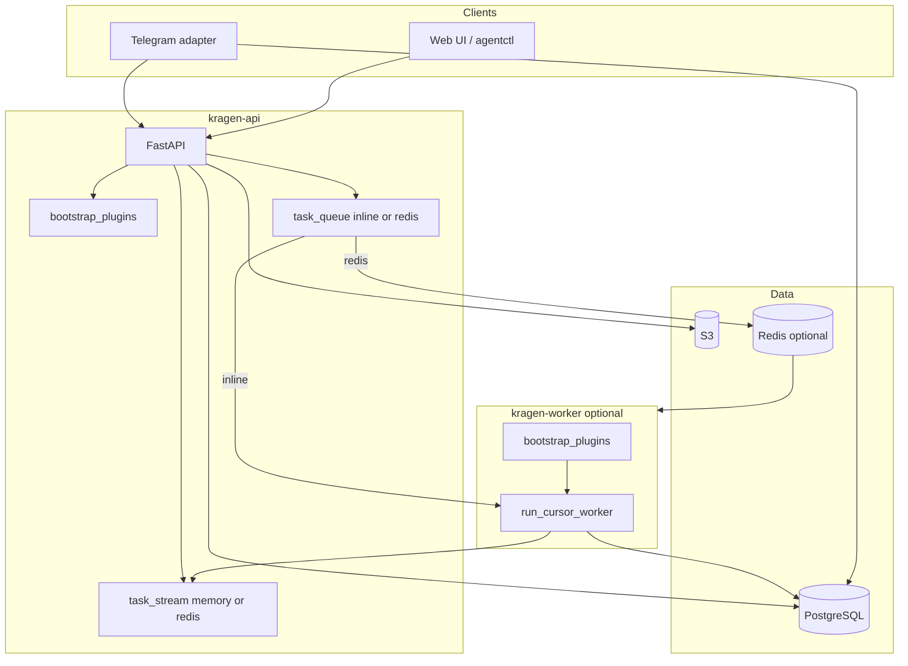

# Kragen architecture review

Assessment snapshot after the May 2026 architecture backlog implementation.
Canonical system description: [ARCHITECTURE.md](ARCHITECTURE.md). Structure and
plugin inventory: [PROJECT_REFACTORING.md](PROJECT_REFACTORING.md).

## Current architecture (as-is)

### Process topology

### Entry points

- `kragen-api` — FastAPI gateway (`src/kragen/api/main.py`).
- `kragen-worker` — Redis task consumer with plugin bootstrap (`src/kragen/worker.py`).
- `kragen-telegram-channel` — `src/kragen/channels/telegram/` (polling/webhook).
- `kragen-service` — combined API + Telegram supervisor.
- Six built-in plugins via `kragen.plugins` entry points (see `pyproject.toml`).

## Strengths

- Clear layering: routes → services → orchestrator; channels as separate processes.
- Unified plugin surface (skills / MCP / backend / channel) with allow-list + admin API.
- **JWT auth path** in `deps.py` (HS256 + OIDC JWKS); prod validator blocks dev-only auth/host/CORS/import/webhook defaults.
- **RBAC:** `ensure_workspace_access` on sessions (incl. create), tasks, files; admin allow-list for `/admin/*`.
- **Redis scale-out:** `TaskStreamBackend` and `TaskQueue` Redis implementations; worker initializes plugins.
- Telegram: message-level idempotency, dedup reaper, webhook secret, package split, `KragenApiGateway`.
- Plugin hardening: spec id collision fail-fast, `requires` topological order + cycle detection, admin `runtime_notes`.
- Observability: structlog, correlation ID, audit, task reaper for stuck `running` tasks.

## Risks and gaps (remaining)

### Plugins

- Backend routers cannot be unmounted at runtime (documented in `/admin/plugins` via `requires_restart`).
- `when="manual"` skills have no session-binding API yet.
- No sandboxing — trusted plugins only.

### Task execution / scale-out

- Redis queue has no ack, retry, or dead-letter queue.
- In-memory stream: silent chunk drop at 4096 chunks; buffer disposed after first disconnect.
- Inline queue runs workers in the API event loop (dev/single-node only).

### Channels / ops

- `kragen-service` does not restart children; use systemd `Restart=`.
- Telegram `/whoami` and similar diagnostics may leak config in unrestricted chats — restrict operationally.
- Audit/retrieval under `/admin` but member-scoped for non-admins (naming confusion).

### Authentication

- Dev defaults still use raw UUID bearer in `configs/kragen.yaml`; production must set `app.environment=prod` and real JWT via `telegram_channel.api_bearer_token` for the bot.

## Prioritized backlog

1. Session skill bindings API for `when="manual"` plugins.
2. Redis task queue reliability (ack/retry/DLQ) and backpressure for inline mode.
3. Optional backend router hot-unmount or dynamic plugin reload (larger change).
4. Rename or relocate member-scoped audit routes away from `/admin` prefix.
5. OpenClaw channel production adapter (currently feature-flagged off).

## Admin RBAC quick reference

- **Admin-only** (`AdminUserId`): `/admin/workers`, `/admin/logs*`, `/admin/memory/status`, `/admin/config/*`, `/admin/cursor-auth/*`, `/admin/plugins/*`.
- **Member-scoped:** `/admin/audit/events`, `/admin/retrieval/logs` require `workspace_id` unless caller is admin.
- `GET /admin/config/kragen-yaml` masks secrets before return.

## Maintenance

Revise when auth model, process topology, or plugin contract changes. Move completed backlog items into **Strengths** with a short note.
